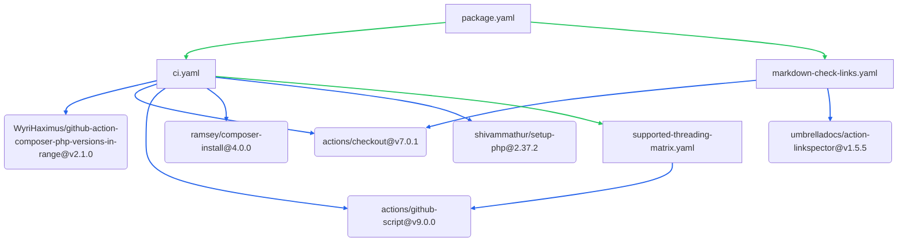
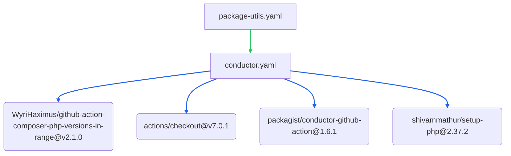
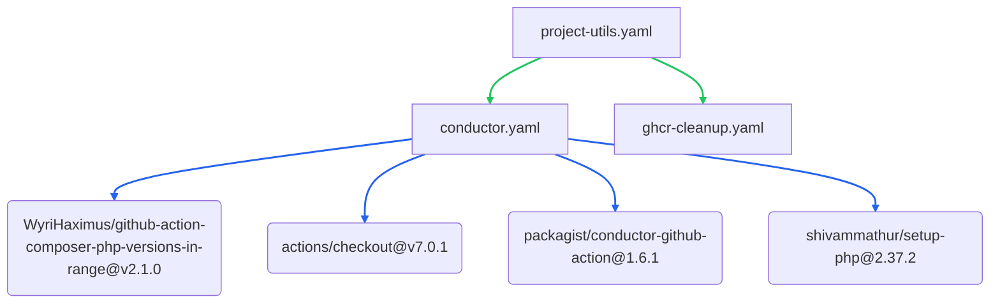

```mermaid
flowchart TB
  package_release_management_composer_diff["composer-diff.yaml"] --> package_release_management_a0("WyriHaximus/github-action-composer.lock-diff@v2.3.0")
  package_release_management_craft_release["craft-release.yaml"] --> package_release_management_a1("WyriHaximus/github-action-jwage-changelog-generator@v1.4.0")
  package_release_management_craft_release["craft-release.yaml"] --> package_release_management_a2("actions/checkout@v7.0.1")
  package_release_management_craft_release["craft-release.yaml"] --> package_release_management_a3("ad-m/github-push-action@v1.3.0")
  package_release_management_craft_release["craft-release.yaml"] --> package_release_management_a4("dawidd6/action-delete-branch@v3.1.0")
  package_release_management_craft_release["craft-release.yaml"] --> package_release_management_a5("haya14busa/action-update-semver@v1.5.1")
  package_release_management_craft_release["craft-release.yaml"] --> package_release_management_a6("softprops/action-gh-release@v3.0.3")
  package_release_management_helm_dependencies["helm-dependencies.yaml"] --> package_release_management_a2("actions/checkout@v7.0.1")
  package_release_management_helm_diff["helm-diff.yaml"] --> package_release_management_a7("WyriHaximus/github-action-get-previous-tag@v2.0.0")
  package_release_management_helm_diff["helm-diff.yaml"] --> package_release_management_a8("WyriHaximus/github-action-helm3@v4.0.2")
  package_release_management_helm_diff["helm-diff.yaml"] --> package_release_management_a2("actions/checkout@v7.0.1")
  package_release_management_helm_diff["helm-diff.yaml"] --> package_release_management_a9("marocchino/sticky-pull-request-comment@v3.0.5")
  package_release_management_package_set_milestone_on_pr["package-set-milestone-on-pr.yaml"] --> package_release_management_a10("WyriHaximus/github-action-composer-php-versions-in-range@v2.1.0")
  package_release_management_package_set_milestone_on_pr["package-set-milestone-on-pr.yaml"] --> package_release_management_a7("WyriHaximus/github-action-get-previous-tag@v2.0.0")
  package_release_management_package_set_milestone_on_pr["package-set-milestone-on-pr.yaml"] --> package_release_management_a11("WyriHaximus/github-action-next-semvers@v1.2.1")
  package_release_management_package_set_milestone_on_pr["package-set-milestone-on-pr.yaml"] --> package_release_management_a2("actions/checkout@v7.0.1")
  package_release_management_package_set_milestone_on_pr["package-set-milestone-on-pr.yaml"] --> package_release_management_a12("dcarbone/install-jq-action@v4.0.1")
  package_release_management_required_labels["required-labels.yaml"] --> package_release_management_a13("mheap/github-action-required-labels@v5.6.0")
  package_release_management_set_milestone_on_pr["set-milestone-on-pr.yaml"] --> package_release_management_a14("WyriHaximus/github-action-create-milestone@v1.2.0")
  package_release_management_set_milestone_on_pr["set-milestone-on-pr.yaml"] --> package_release_management_a12("dcarbone/install-jq-action@v4.0.1")
  package_release_management_supported_threading_matrix["supported-threading-matrix.yaml"] --> package_release_management_a15("actions/github-script@v9.0.0")
  package_release_management_terraform_diff["terraform-diff.yaml"] --> package_release_management_a2("actions/checkout@v7.0.1")
  package_release_management_terraform_diff["terraform-diff.yaml"] --> package_release_management_a15("actions/github-script@v9.0.0")
  package_release_management_terraform_diff["terraform-diff.yaml"] --> package_release_management_a9("marocchino/sticky-pull-request-comment@v3.0.5")
  package_release_management_diff["diff.yaml"] --> package_release_management_composer_diff["composer-diff.yaml"]
  package_release_management_diff["diff.yaml"] --> package_release_management_helm_diff["helm-diff.yaml"]
  package_release_management_diff["diff.yaml"] --> package_release_management_terraform_diff["terraform-diff.yaml"]
  package_release_management_helm_diff["helm-diff.yaml"] --> package_release_management_helm_dependencies["helm-dependencies.yaml"]
  package_release_management_package_release_management["package-release-management.yaml"] --> package_release_management_craft_release["craft-release.yaml"]
  package_release_management_package_release_management["package-release-management.yaml"] --> package_release_management_diff["diff.yaml"]
  package_release_management_package_release_management["package-release-management.yaml"] --> package_release_management_package_set_milestone_on_pr["package-set-milestone-on-pr.yaml"]
  package_release_management_package_release_management["package-release-management.yaml"] --> package_release_management_required_labels["required-labels.yaml"]
  package_release_management_package_set_milestone_on_pr["package-set-milestone-on-pr.yaml"] --> package_release_management_set_milestone_on_pr["set-milestone-on-pr.yaml"]
  package_release_management_package_set_milestone_on_pr["package-set-milestone-on-pr.yaml"] --> package_release_management_supported_threading_matrix["supported-threading-matrix.yaml"]
  linkStyle 24,25,26,27,28,29,30,31,32,33 stroke:#22c55e,stroke-width:2px
  linkStyle 0,1,2,3,4,5,6,7,8,9,10,11,12,13,14,15,16,17,18,19,20,21,22,23 stroke:#2563eb,stroke-width:2px
  click package_release_management_a0 "https://github.com/WyriHaximus/github-action-composer.lock-diff/releases/tag/v2.3.0" _blank
  click package_release_management_a1 "https://github.com/WyriHaximus/github-action-jwage-changelog-generator/releases/tag/v1.4.0" _blank
  click package_release_management_a10 "https://github.com/WyriHaximus/github-action-composer-php-versions-in-range/releases/tag/v2.1.0" _blank
  click package_release_management_a11 "https://github.com/WyriHaximus/github-action-next-semvers/releases/tag/v1.2.1" _blank
  click package_release_management_a12 "https://github.com/dcarbone/install-jq-action/releases/tag/v4.0.1" _blank
  click package_release_management_a13 "https://github.com/mheap/github-action-required-labels/releases/tag/v5.6.0" _blank
  click package_release_management_a14 "https://github.com/WyriHaximus/github-action-create-milestone/releases/tag/v1.2.0" _blank
  click package_release_management_a15 "https://github.com/actions/github-script/releases/tag/v9.0.0" _blank
  click package_release_management_a2 "https://github.com/actions/checkout/releases/tag/v7.0.1" _blank
  click package_release_management_a3 "https://github.com/ad-m/github-push-action/releases/tag/v1.3.0" _blank
  click package_release_management_a4 "https://github.com/dawidd6/action-delete-branch/releases/tag/v3.1.0" _blank
  click package_release_management_a5 "https://github.com/haya14busa/action-update-semver/releases/tag/v1.5.1" _blank
  click package_release_management_a6 "https://github.com/softprops/action-gh-release/releases/tag/v3.0.3" _blank
  click package_release_management_a7 "https://github.com/WyriHaximus/github-action-get-previous-tag/releases/tag/v2.0.0" _blank
  click package_release_management_a8 "https://github.com/WyriHaximus/github-action-helm3/releases/tag/v4.0.2" _blank
  click package_release_management_a9 "https://github.com/marocchino/sticky-pull-request-comment/releases/tag/v3.0.5" _blank
  click package_release_management_composer_diff "https://github.com/WyriHaximus/github-workflows/blob/main/.github/workflows/composer-diff.yaml" _blank
  click package_release_management_craft_release "https://github.com/WyriHaximus/github-workflows/blob/main/.github/workflows/craft-release.yaml" _blank
  click package_release_management_diff "https://github.com/WyriHaximus/github-workflows/blob/main/.github/workflows/diff.yaml" _blank
  click package_release_management_helm_dependencies "https://github.com/WyriHaximus/github-workflows/blob/main/.github/workflows/helm-dependencies.yaml" _blank
  click package_release_management_helm_diff "https://github.com/WyriHaximus/github-workflows/blob/main/.github/workflows/helm-diff.yaml" _blank
  click package_release_management_package_release_management "https://github.com/WyriHaximus/github-workflows/blob/main/.github/workflows/package-release-management.yaml" _blank
  click package_release_management_package_set_milestone_on_pr "https://github.com/WyriHaximus/github-workflows/blob/main/.github/workflows/package-set-milestone-on-pr.yaml" _blank
  click package_release_management_required_labels "https://github.com/WyriHaximus/github-workflows/blob/main/.github/workflows/required-labels.yaml" _blank
  click package_release_management_set_milestone_on_pr "https://github.com/WyriHaximus/github-workflows/blob/main/.github/workflows/set-milestone-on-pr.yaml" _blank
  click package_release_management_supported_threading_matrix "https://github.com/WyriHaximus/github-workflows/blob/main/.github/workflows/supported-threading-matrix.yaml" _blank
  click package_release_management_terraform_diff "https://github.com/WyriHaximus/github-workflows/blob/main/.github/workflows/terraform-diff.yaml" _blank
```

```mermaid
flowchart TB
  project_ci["ci.yaml"] --> project_a0("WyriHaximus/github-action-composer-php-versions-in-range@v2.1.0")
  project_ci["ci.yaml"] --> project_a1("actions/checkout@v7.0.1")
  project_ci["ci.yaml"] --> project_a2("actions/github-script@v9.0.0")
  project_ci["ci.yaml"] --> project_a3("ramsey/composer-install@4.0.0")
  project_ci["ci.yaml"] --> project_a4("shivammathur/setup-php@2.37.2")
  project_markdown_check_links["markdown-check-links.yaml"] --> project_a1("actions/checkout@v7.0.1")
  project_markdown_check_links["markdown-check-links.yaml"] --> project_a5("umbrelladocs/action-linkspector@v1.5.5")
  project_oci_build_single["oci-build-single.yaml"] --> project_a1("actions/checkout@v7.0.1")
  project_oci_build_single["oci-build-single.yaml"] --> project_a6("docker/login-action@v4.6.0")
  project_oci_build_single["oci-build-single.yaml"] --> project_a7("docker/setup-buildx-action@v4.3.0")
  project_oci_build_single["oci-build-single.yaml"] --> project_a8("docker/setup-qemu-action@v4.2.0")
  project_oci_build_single["oci-build-single.yaml"] --> project_a9("wyrihaximus/github-action-oci-image-supported-platforms@v1.0.0")
  project_oci_build_spread["oci-build-spread.yaml"] --> project_a1("actions/checkout@v7.0.1")
  project_oci_build_spread["oci-build-spread.yaml"] --> project_a10("actions/download-artifact@v8.0.1")
  project_oci_build_spread["oci-build-spread.yaml"] --> project_a11("actions/upload-artifact@v7.0.1")
  project_oci_build_spread["oci-build-spread.yaml"] --> project_a6("docker/login-action@v4.6.0")
  project_oci_build_spread["oci-build-spread.yaml"] --> project_a7("docker/setup-buildx-action@v4.3.0")
  project_oci_build_spread["oci-build-spread.yaml"] --> project_a8("docker/setup-qemu-action@v4.2.0")
  project_oci_build_spread["oci-build-spread.yaml"] --> project_a9("wyrihaximus/github-action-oci-image-supported-platforms@v1.0.0")
  project_supported_threading_matrix["supported-threading-matrix.yaml"] --> project_a2("actions/github-script@v9.0.0")
  project_ci["ci.yaml"] --> project_supported_threading_matrix["supported-threading-matrix.yaml"]
  project_project["project.yaml"] --> project_ci["ci.yaml"]
  project_project["project.yaml"] --> project_markdown_check_links["markdown-check-links.yaml"]
  project_project["project.yaml"] --> project_oci_build_single["oci-build-single.yaml"]
  project_project["project.yaml"] --> project_oci_build_spread["oci-build-spread.yaml"]
  linkStyle 20,21,22,23,24 stroke:#22c55e,stroke-width:2px
  linkStyle 0,1,2,3,4,5,6,7,8,9,10,11,12,13,14,15,16,17,18,19 stroke:#2563eb,stroke-width:2px
  click project_a0 "https://github.com/WyriHaximus/github-action-composer-php-versions-in-range/releases/tag/v2.1.0" _blank
  click project_a1 "https://github.com/actions/checkout/releases/tag/v7.0.1" _blank
  click project_a10 "https://github.com/actions/download-artifact/releases/tag/v8.0.1" _blank
  click project_a11 "https://github.com/actions/upload-artifact/releases/tag/v7.0.1" _blank
  click project_a2 "https://github.com/actions/github-script/releases/tag/v9.0.0" _blank
  click project_a3 "https://github.com/ramsey/composer-install/releases/tag/4.0.0" _blank
  click project_a4 "https://github.com/shivammathur/setup-php/releases/tag/2.37.2" _blank
  click project_a5 "https://github.com/umbrelladocs/action-linkspector/releases/tag/v1.5.5" _blank
  click project_a6 "https://github.com/docker/login-action/releases/tag/v4.6.0" _blank
  click project_a7 "https://github.com/docker/setup-buildx-action/releases/tag/v4.3.0" _blank
  click project_a8 "https://github.com/docker/setup-qemu-action/releases/tag/v4.2.0" _blank
  click project_a9 "https://github.com/wyrihaximus/github-action-oci-image-supported-platforms/releases/tag/v1.0.0" _blank
  click project_ci "https://github.com/WyriHaximus/github-workflows/blob/main/.github/workflows/ci.yaml" _blank
  click project_markdown_check_links "https://github.com/WyriHaximus/github-workflows/blob/main/.github/workflows/markdown-check-links.yaml" _blank
  click project_oci_build_single "https://github.com/WyriHaximus/github-workflows/blob/main/.github/workflows/oci-build-single.yaml" _blank
  click project_oci_build_spread "https://github.com/WyriHaximus/github-workflows/blob/main/.github/workflows/oci-build-spread.yaml" _blank
  click project_project "https://github.com/WyriHaximus/github-workflows/blob/main/.github/workflows/project.yaml" _blank
  click project_supported_threading_matrix "https://github.com/WyriHaximus/github-workflows/blob/main/.github/workflows/supported-threading-matrix.yaml" _blank
```

# Opinionated configurable GitHub Actions Workflows

These are my personal opinionated configurable GitHub Actions Workflows, aimed at my personal needs to be the single 
central point of all my GitHub Actions Workflows. Over the years most of my workflows started from one or two and 
diverged in all directions, this repository is to reel that all back in one easy to maintain them for all my 
repositories.

## Opinionated choices

### Runs On

Each workflow, well most of them, take two runs-on arguments `runsOn` and `runsOnOrder`. As the names suggest
`runsOn` runs as many jobs at the same time as possible where `runsOnOrder` runs them one by one. For most
jobs `runsOn` is fine, but for things like `TerraForm` apply, and `Helm` install where state somewhere is
changed and only one can run at the same time `runsOnOrder` is the way to go. Mainly came to this while working on 
getting the workflows managing my home cluster to work as intended:


When not set they all default to `ubuntu-latest` which means it will run on GitHub provided Runners.

### Makefile

All the quality control checks for the CI entry point are handled and controlled through Makefiles this gives each
project the control to check and assert everything relevant to it. When creating the task matrix the repositories the
Makefile is expected to have a `task-list-ci` command which will output a JSON array of tasks.

### Sparse Checkout

Sparse checkout is used as much as possible to keep job run times as long as possible. Several of my projects have
1GB+ binary test data checked in, this takes some time to checkout, maybe even more so on Raspberry Pis. By
aggressively using the `sparse-checkout` checkout option [`actions/checkout`](https://github.com/actions/checkout/)
provides checkout times plummeted. For the biggest repo this went down to 4 seconds from 66 seconds without sparse
checkout. This resulted in a few inputs being such as `ociSparseCheckout`, `helmSparseCheckout`, and
`terraformSparseCheckout`. Each of those 3 is used with `sparse-checkout-cone-mode: false` meaning that you can use
patterns like the following in there:
```yaml
sparseCheckout: |
  !/*
  /.terraform/*
  /**/*.md
  /composer.json
  /composer.lock
```

Also since those are free form fields you're expected to put in `workingDirectory` and `terraformDirectory` your self.
For example in the case of `TerraForm` the full checkout step is:

```yaml
 - uses: actions/checkout@v4
   with:
     sparse-checkout-cone-mode: false
     sparse-checkout: |
       !${{ inputs.workingDirectory }}/*
       /${{ inputs.workingDirectory }}${{ inputs.terraformDirectory }}*
       ${{ inputs.terraformSparseCheckout }}
```

### Versioning

Everything going through the package endpoints assumes [`Semantic Versioning`](https://semver.org/), and has
automation to automatically decide what the appropriate version bump is. Projects use monotonically increasing release
version, `r1`, `r2`, `r13`, `r66` etc etc.

### OCI images

All images are pushing to GitHub's container registry at `ghcr.io` with the full repository name as image name taken
from `${{ github.repository }}`. On each build image image tag will be `sha-COMMIT_SHA` where `COMMIT_SHA` is
taken from `${{ github.sha }}`.

Release images are tagged with the passed milestone title as the image tag.

## Entry points

There are to types of entry points supported. `Package` and `project`, the former is meant for 
PHP packages/GitHub Actions/Anything-that-is-not-a-project while the latter is for websites/services.

### Release Management

Each type has three entry points. The first being `Release Management`, which takes care of everything related to 
releasing new versions and all the information and bits required for that. This includes:

* Required labels
* Package Manager/Helm/TerraForm Diff
* OCI image retaging
* Helm deploy to Kubernetes
* Setting a milestone on PR's
* Creating a GitHub release
* Generating a changelog
* Push static content to a CDN

It should be triggered for the following events:

* Closing of a milestone
* PR's for the follow types: `opened`, `labeled`, `unlabeled`, `synchronize`, `reopened`, `milestoned`, `demilestoned`, and `ready_for_review`.

#### CI

The other entry point is `CI` it does everything related to validating the current push of the code meets expectations
through a series of [`Makefile`](#Makefile) commands. When present CI will also build the OCI (Docker) image if
present. Any control over the different platforms the OCI image is released for is done here, the release management
doing any retagging will detect which platforms are in the image it retags and uses those without the need to
configure them.

#### Utils

The third entry point is `Utils`. It covers scheduled and event-driven maintenance that does not belong in CI or
Release Management. Packages use it for [Private Packagist Conductor](https://github.com/packagist/conductor-github-action)
on `repository_dispatch` with the `dependency_update` event type. Projects add GHCR image cleanup on `push`,
`schedule`, and `workflow_dispatch` in addition to Conductor when enabled.

## What's included

And how to configure it.

### CI

The CI entry point only takes two configuration inputs `env` and `services`, both take a JSON string as argument.
For example adding the Redis DSN to the environment is written as:

```yaml
with:
  env: "{\"REDIS_DSN\":\"redis://redis:6379/6\"}"
```

While the service providing redis is written as:

```yaml
with:
  services: "{\"redis\":{\"image\":\"redis\",\"options\":\"--health-cmd \\\"redis-cli ping\\\" --health-interval 1s --health-timeout 5s --health-retries 50\"}}"
```

### Docker/OCI

The OCI image building and retagging responsibilities using Docker are split between the CI and Release Management
entry points. CI builds the images and decides what goes into them and for what platform, while Release Management
purely retags the images build by CI.

CI will only build images if you provide the `Dockerfile` you're using through the `dockerfile` input. Provide
`dockerBuildTarget` when using a multi-stage Docker file to build the desired target. Any additional arguments can be
passed to the Docker build command using `dockerBuildExtraArguments`.

By default the OCI build workflow will detect all the platforms the first upstream image found in `FROM` is build for
and build the image for the same platforms. If you want to override that pass an `CSV` of different platforms to the
`ociPlatforms` in put in this format: `linux/amd64,linux/arm`.

To speed up checking out during building `ociSparseCheckout` can be used to exclude any files we don't care about and
will slowdown our checkout. For example in one of my projects the `tests/data/` directory contains 1GB+ binary data
for testing, I have zero need to check that out during image build. So my sparse checkout allows everything but any
file from `tests/data/`:

```yaml
ociSparseCheckout: |
  /*
  !/tests/data/*
```

To kick off retagging simple set `ociRetag` to `true` on the Release Management entry point.

### Helm

When the `helmDirectory` is passed to the release management entry point isn't an empty string both the
Helm Diff and Helm Deploy workflows are executed against that directory.

As with any Helm chart being deployed we need to give it a name, the `helmReleaseName` is used to specify that.

By default a sparse checkout is performed and only the passed `helmDirectory` is checked out, if you need than
that you can use `helmSparseCheckout` with additional patterns to check out.

Helm chart repositories are detected automatically before diff and deploy. The `helm-dependencies`
workflow scans `repository:` entries in `Chart.yaml`, `Chart.lock`, and `charts/*/Chart.yaml`, then runs `helm repo add` for each
unique HTTPS repository before `helm dependency build`.

Repository detection runs on `runsOnChaos`. Helm diff, deploy, and dependency build run on `runsOnOrder`.

To set additional values or to overwrite existing values from `values.yaml` `helmAdditionalArguments` can be used to
pass any additional args to the diff and upgrade commands. For example to get dynamically generated values from
another job:

```yaml
name: Release Management
on:
  pull_request:
    types:
      - opened
      - labeled
      - unlabeled
      - synchronize
      - reopened
  milestone:
    types:
      - closed
permissions:
  contents: write
  issues: write
  pull-requests: write
  packages: write
jobs:
  helm-json:
    name: Generate JSON for Helm
    runs-on: chaos
    outputs:
      helm-json: ${{ steps.helm-json.outputs.helm-json }}
    steps:
      - run: printf "helm-json=%s" $(echo "{\"LOGLEVEL\":\"DEBUG\"}") >> $GITHUB_OUTPUT
  release-management:
    name: Release Management
    needs:
      - helm-json
    secrets: inherit
    uses: WyriHaximus/github-workflows/.github/workflows/project-release-management.yaml@main
    with:
      runsOnChaos: chaos
      runsOnOrder: queue
      type: kubernetes
      milestone: ${{ github.event.milestone.title }}
      description: ${{ github.event.milestone.description }}
      kubeConfigSecret: HOME_KUBE_CONFIG
      helmDirectory: deploy/helm/
      helmReleaseName: my-app
      helmReleaseValueName: image.tag
      helmSparseCheckout: |
        /deploy/helm/charts/*
      helmAdditionalArguments: --set-json='application=${{ needs.helm-json.outputs.helm-json }}'
      helmUpdateAppVersion: true
      terraformDirectory: deploy/terraform/
      terraformVars: |
        kubernetes_config_path   = "~/.kube/config"
        kubernetes_context       = "$HOME_KUBE_CONTEXT"
        kubernetes_namespace     = "$HOME_KUBE_NAMESPACE"
      ociRetag: true
```

Because these workflows provide diff comments on PR's for Helm and others we need to specify `helmReleaseValueName` so
we can assign the previous tag on diff and closed milestone on deploy to that value. We can't use `helmAdditionalArguments` for this as we
autodetect the previous tag. Similarly `helmUpdateAppVersion` is used to update the `appVersion` in `Chart.yaml`,
when set to `true`, with the same value in those two scenarios.

### Linting

A few, maybe somewhat random, linters are included in the work flows. One of them checks if links in markdown
resources are responding with a ~200 status code and errors when they are no longer working.

### Utils

#### Conductor

When `disableConductor` is `false` (the default), the Utils entry point runs [Packagist Conductor](https://github.com/packagist/conductor-github-action)
after Private Packagist dispatches a `repository_dispatch` event with the `dependency_update` type. The workflow
checks out `composer.json` and `composer.lock`, resolves the lowest supported PHP version from the lock file, and
runs Conductor in that environment.

The caller workflow needs `contents: read` when Conductor is enabled.

#### GHCR image cleanup

Project Utils can prune old container images from GHCR on `push` to configured branches, on a nightly schedule, and
on manual `workflow_dispatch`. Set `disableGhcrCleanup: true` to skip it. See the Projects Utils usage section below for tag
retention rules, PAT configuration, and inputs.

### TerraForm

When the `terraformDirectory` is passed to the release management entry point isn't an empty string both the
TerraForm Diff and TerraForm Apply workflows are executed against that directory. The repository is expecting to have
the following secrets for TerraForm state storage on S3:

* `TERRAFORM_STATE_KEY`
* `TERRAFORM_STATE_SECRET`
* `TERRAFORM_STATE_BUCKET`
* `TERRAFORM_STATE_REGION`

By default a sparse checkout is performed and only the passed `terraformDirectory` is checked out, if you need than
that you can use `terraformSparseCheckout` with additional patterns to check out. Further more `terraformParallelism`
and `terraformLogLevel` can be used to tune TerraForm's behavior.

In order to inject variables into TerraForm `terraformVars` is used to create `terraform.tfvars` in
the `terraformDirectory`. Variables can be hard coded but secrets are available as environment variables:

```yaml
terraformVars: |
  kubernetes_config_path   = "~/.kube/config"
  kubernetes_context       = "$HOME_KUBE_CONTEXT"
  kubernetes_namespace     = "$HOME_KUBE_NAMESPACE"
```

## Usage

Workflow connection diagrams are generated automatically from reusable workflow `uses:` references when running `make generate`.

### Packages

#### CI

```yaml
name: Continuous Integration
on:
  push:
    branches:
      - 'main'
      - 'master'
      - 'refs/heads/v[0-9]+.[0-9]+.[0-9]+'
      - 'refs/heads/[0-9]+.[0-9]+.[0-9]+'
  pull_request:
## This workflow needs the `pull-request` permissions to work for the package diffing
## Refs: https://docs.github.com/en/actions/reference/workflow-syntax-for-github-actions#permissions
permissions:
  pull-requests: write
  contents: read
jobs:
  ci:
    name: Continuous Integration
    uses: WyriHaximus/github-workflows/.github/workflows/package.yaml@main
```

##### Workflow connections




##### Inputs

| Input | Type | Description | Default |
|-------|------|-------------|---------|
| dependencyUpdaters | string | CSV list of bot AppId&#039;s that create PR&#039;s to updated dependencies like RenovateBot and DependaBot | 49699333 |
| directlyOnOsRunsOnMap | string | Map of supported-features keys to JSON arrays of runs-on labels for directly-on-os CI jobs | {&quot;linux&quot;:[&quot;ubuntu-latest&quot;,&quot;ubuntu-24.04-arm&quot;],&quot;macos&quot;:[&quot;macos-latest&quot;],&quot;windows&quot;:[&quot;windows-latest&quot;,&quot;windows-11-arm&quot;]} |
| env | string | Any additional environment variables | {} |
| jsonPattern | string | The pattern to match which JSON files to check | \.json$ |
| markdownLinkCheckSparseCheckout | string | Additional files/patterns for the sparse checkout |  |
| runsOnChaos | string | Define on which runner to run workflows where order doesn&#039;t matter should run | ubuntu-latest |
| runsOnOrder | string | Define on which runner to run workflows where order matters should run | ubuntu-latest |
| runsOnQASteps | string | Define on which runner to run workflows where QA ssteps should run | ubuntu-latest |
| services | string | Any additional services to use | {} |
| supportedChecksCommand | string | The make command to invoke listing the different tasks to run across all versions, will also act as a prefix for All, Direct on OS, Lowest, Locked, and Highest task lists. | task-list-ci |
| supportedFeaturesCommand | string | The make command to invoke listing the different tasks to run across all versions, will also act as a prefix for All, Direct on OS, Lowest, Locked, and Highest task lists. | supported-features |
| workingDirectory | string | The directory to run this workflow in |  |

#### Release Management

```yaml
name: Release Management
on:
  pull_request:
    types:
      - opened
      - labeled
      - unlabeled
      - synchronize
      - reopened
      - milestoned
      - demilestoned
      - ready_for_review
  milestone:
    types:
      - closed
permissions:
  contents: write
  issues: write
  pull-requests: write
jobs:
  release-management:
    name: Create Release
    uses: WyriHaximus/github-workflows/.github/workflows/package-release-management.yaml@main
    with:
      milestone: ${{ github.event.milestone.title }}
      description: ${{ github.event.milestone.title }}
```

##### Workflow connections




##### Inputs

| Input | Type | Description | Default |
|-------|------|-------------|---------|
| branch | string | The branch to tag the release on |  |
| description | string | Additional information to add above the changelog in the release |  |
| disableSetMilestone | boolean | Disable the setting of milestones |  |
| initialTag | string | The tag to fallback to when no previous tag could be found. | 1.0.0 |
| labels | string | The labels to for the sections of the changelog | Bug 🐞,Configuration ⚙,Dependencies 📦,Deprecations 👋,Enhancement ✨,Feature 🏗,Security 🕵️‍♀️ |
| milestone | string | The milestone to tag |  |
| preReleaseScript | string | Script that runs just before the release is created |  |
| runsOnChaos | string | Define on which runner to run workflows where order doesn&#039;t matter should run | ubuntu-latest |
| runsOnOrder | string | Define on which runner to run workflows where order matters should run | ubuntu-latest |

#### Utils

Private Packagist Conductor on `repository_dispatch` with the `dependency_update` event type.

```yaml
name: Utils
on:
  repository_dispatch:
    types:
      - dependency_update
permissions:
  contents: read
jobs:
  utils:
    uses: WyriHaximus/github-workflows/.github/workflows/package-utils.yaml@main
    with:
      runsOn: ubuntu-latest
```

##### Workflow connections




##### Inputs

| Input | Type | Description | Default |
|-------|------|-------------|---------|
| disableConductor | boolean | Disable the execution of Conductor on `repository_dispatch` with `dependency_update` as event type |  |
| runsOn | string | Define on which runner to run workflows where order doesn&#039;t matter should run | ubuntu-latest |
| workingDirectory | string | The directory to run this workflow in |  |

### Projects

#### CI

```yaml
name: Continuous Integration
on:
  push:
    branches:
      - 'main'
      - 'master'
      - 'refs/heads/r[0-9]+'
  pull_request:
## This workflow needs the `pull-request` permissions to work for the package diffing
## Refs: https://docs.github.com/en/actions/reference/workflow-syntax-for-github-actions#permissions
permissions:
  pull-requests: write
  contents: read
  packages: write
jobs:
  ci:
    name: Continuous Integration
    uses: WyriHaximus/github-workflows/.github/workflows/project.yaml@main
    secrets: inherit
    with:
      runsOnChaos: chaos
      runsOnOrder: queue
```

##### Workflow connections




##### Inputs

| Input | Type | Description | Default |
|-------|------|-------------|---------|
| artifactRetentionDays | number | Number of days to retain uploaded artifacts | 1 |
| dependencyUpdaters | string | CSV list of bot AppId&#039;s that create PR&#039;s to updated dependencies like RenovateBot and DependaBot | 49699333 |
| disableComposerLockDiff | boolean | Disable the diffing of composer lock files |  |
| disableMarkdownLinkCheck | boolean | Disable the checking of links in markdown files |  |
| disableRequiredLabels | boolean | Disable failing PR&#039;s when certain labels are missing |  |
| dockerBuildExtraArguments | string | Extra arguments to pass to the docker build command |  |
| dockerBuildTarget | string | Value for the --target flag |  |
| dockerfile | string | The Dockerfile to build |  |
| env | string | Any additional environment variables | {} |
| jsonPattern | string | The pattern to match which JSON files to check | \.json$ |
| markdownLinkCheckSparseCheckout | string | Additional files/patterns for the sparse checkout |  |
| ociPlatformRunnerSuffixMap | string | Map that maps the platform to the runner suffix | {&quot;linux/arm64&quot;: &quot;-arm64&quot;, &quot;linux/amd64&quot;: &quot;-amd64&quot;} |
| ociPlatforms | string | The platforms to build the OCI image for, empty means autodetect |  |
| ociPushSecretSecret | string | The secret name that holds the token to push OCI images to GHCR.io | GITHUB_TOKEN |
| ociRegistry | string | The secret name that holds the token to push OCI images to GHCR.io | ghcr.io |
| ociSparseCheckout | string | Sparse checkout patterns in cone mode |  |
| ociSpreadBuild | string | Spread the build OCI images over different runners |  |
| runsOnChaos | string | Define on which runner to run workflows where order doesn&#039;t matter should run | ubuntu-latest |
| runsOnOrder | string | Define on which runner to run workflows where order matters should run | ubuntu-latest |
| services | string | Any additional services to use | {} |
| workingDirectory | string | The directory to run this workflow in |  |

#### Release Management

```yaml
name: Release Management
on:
  pull_request:
    types:
      - opened
      - labeled
      - unlabeled
      - synchronize
      - reopened
  milestone:
    types:
      - closed
permissions:
  contents: write
  issues: write
  pull-requests: write
  packages: write
jobs:
  release-management:
    name: Release Management
    secrets: inherit
    uses: WyriHaximus/github-workflows/.github/workflows/project-release-management.yaml@main
    with:
      milestone: ${{ github.event.milestone.title }}
      description: ${{ github.event.milestone.description }}
      runsOnChaos: chaos
      runsOnOrder: queue
```

##### Workflow connections

```mermaid
flowchart TB
  project_release_management_composer_diff["composer-diff.yaml"] --> project_release_management_a0("WyriHaximus/github-action-composer.lock-diff@v2.3.0")
  project_release_management_craft_release["craft-release.yaml"] --> project_release_management_a1("WyriHaximus/github-action-jwage-changelog-generator@v1.4.0")
  project_release_management_craft_release["craft-release.yaml"] --> project_release_management_a2("actions/checkout@v7.0.1")
  project_release_management_craft_release["craft-release.yaml"] --> project_release_management_a3("ad-m/github-push-action@v1.3.0")
  project_release_management_craft_release["craft-release.yaml"] --> project_release_management_a4("dawidd6/action-delete-branch@v3.1.0")
  project_release_management_craft_release["craft-release.yaml"] --> project_release_management_a5("haya14busa/action-update-semver@v1.5.1")
  project_release_management_craft_release["craft-release.yaml"] --> project_release_management_a6("softprops/action-gh-release@v3.0.3")
  project_release_management_helm_dependencies["helm-dependencies.yaml"] --> project_release_management_a2("actions/checkout@v7.0.1")
  project_release_management_helm_deploy["helm-deploy.yaml"] --> project_release_management_a7("WyriHaximus/github-action-helm3@v4.0.2")
  project_release_management_helm_deploy["helm-deploy.yaml"] --> project_release_management_a2("actions/checkout@v7.0.1")
  project_release_management_helm_diff["helm-diff.yaml"] --> project_release_management_a8("WyriHaximus/github-action-get-previous-tag@v2.0.0")
  project_release_management_helm_diff["helm-diff.yaml"] --> project_release_management_a7("WyriHaximus/github-action-helm3@v4.0.2")
  project_release_management_helm_diff["helm-diff.yaml"] --> project_release_management_a2("actions/checkout@v7.0.1")
  project_release_management_helm_diff["helm-diff.yaml"] --> project_release_management_a9("marocchino/sticky-pull-request-comment@v3.0.5")
  project_release_management_oci_retag["oci-retag.yaml"] --> project_release_management_a10("docker/login-action@v4.6.0")
  project_release_management_oci_retag["oci-retag.yaml"] --> project_release_management_a11("docker/setup-buildx-action@v4.3.0")
  project_release_management_oci_retag["oci-retag.yaml"] --> project_release_management_a12("docker/setup-qemu-action@v4.2.0")
  project_release_management_oci_retag["oci-retag.yaml"] --> project_release_management_a13("int128/wait-for-docker-image-action@v1.28.0")
  project_release_management_oci_retag["oci-retag.yaml"] --> project_release_management_a14("nick-invision/retry@v4.0.0")
  project_release_management_oci_retag["oci-retag.yaml"] --> project_release_management_a15("wyrihaximus/github-action-oci-image-supported-platforms@v1.0.0")
  project_release_management_project_craft_release_cdn_build_commands["project-craft-release-cdn-build-commands.yaml"] --> project_release_management_a2("actions/checkout@v7.0.1")
  project_release_management_project_craft_release_cdn_build_commands["project-craft-release-cdn-build-commands.yaml"] --> project_release_management_a16("actions/upload-artifact@v7.0.1")
  project_release_management_project_craft_release_serverless["project-craft-release-serverless.yaml"] --> project_release_management_a17("WyriHaximus/github-action-composer-php-versions-in-range@v2.1.0")
  project_release_management_project_craft_release_serverless["project-craft-release-serverless.yaml"] --> project_release_management_a2("actions/checkout@v7.0.1")
  project_release_management_project_craft_release_serverless["project-craft-release-serverless.yaml"] --> project_release_management_a18("ramsey/composer-install@4.0.0")
  project_release_management_project_craft_release_static["project-craft-release-static.yaml"] --> project_release_management_a2("actions/checkout@v7.0.1")
  project_release_management_project_craft_release_static["project-craft-release-static.yaml"] --> project_release_management_a16("actions/upload-artifact@v7.0.1")
  project_release_management_project_set_milestone_on_pr["project-set-milestone-on-pr.yaml"] --> project_release_management_a8("WyriHaximus/github-action-get-previous-tag@v2.0.0")
  project_release_management_project_set_milestone_on_pr["project-set-milestone-on-pr.yaml"] --> project_release_management_a19("WyriHaximus/github-action-next-release-version@v1.1.0")
  project_release_management_project_set_milestone_on_pr["project-set-milestone-on-pr.yaml"] --> project_release_management_a2("actions/checkout@v7.0.1")
  project_release_management_required_labels["required-labels.yaml"] --> project_release_management_a20("mheap/github-action-required-labels@v5.6.0")
  project_release_management_s3_upload["s3-upload.yaml"] --> project_release_management_a21("actions/download-artifact@v8.0.1")
  project_release_management_s3_upload["s3-upload.yaml"] --> project_release_management_a22("aws-actions/configure-aws-credentials@v6.2.3")
  project_release_management_set_milestone_on_pr["set-milestone-on-pr.yaml"] --> project_release_management_a23("WyriHaximus/github-action-create-milestone@v1.2.0")
  project_release_management_set_milestone_on_pr["set-milestone-on-pr.yaml"] --> project_release_management_a24("dcarbone/install-jq-action@v4.0.1")
  project_release_management_terraform_apply["terraform-apply.yaml"] --> project_release_management_a2("actions/checkout@v7.0.1")
  project_release_management_terraform_diff["terraform-diff.yaml"] --> project_release_management_a2("actions/checkout@v7.0.1")
  project_release_management_terraform_diff["terraform-diff.yaml"] --> project_release_management_a25("actions/github-script@v9.0.0")
  project_release_management_terraform_diff["terraform-diff.yaml"] --> project_release_management_a9("marocchino/sticky-pull-request-comment@v3.0.5")
  project_release_management_diff["diff.yaml"] --> project_release_management_composer_diff["composer-diff.yaml"]
  project_release_management_diff["diff.yaml"] --> project_release_management_helm_diff["helm-diff.yaml"]
  project_release_management_diff["diff.yaml"] --> project_release_management_terraform_diff["terraform-diff.yaml"]
  project_release_management_helm_deploy["helm-deploy.yaml"] --> project_release_management_helm_dependencies["helm-dependencies.yaml"]
  project_release_management_helm_diff["helm-diff.yaml"] --> project_release_management_helm_dependencies["helm-dependencies.yaml"]
  project_release_management_project_craft_release_cdn_build_vitepress["project-craft-release-cdn-build-vitepress.yaml"] --> project_release_management_project_craft_release_cdn_build_commands["project-craft-release-cdn-build-commands.yaml"]
  project_release_management_project_craft_release_cdn_build["project-craft-release-cdn-build.yaml"] --> project_release_management_project_craft_release_cdn_build_commands["project-craft-release-cdn-build-commands.yaml"]
  project_release_management_project_craft_release_cdn_build["project-craft-release-cdn-build.yaml"] --> project_release_management_project_craft_release_cdn_build_vitepress["project-craft-release-cdn-build-vitepress.yaml"]
  project_release_management_project_craft_release_cdn["project-craft-release-cdn.yaml"] --> project_release_management_project_craft_release_cdn_build["project-craft-release-cdn-build.yaml"]
  project_release_management_project_craft_release_cdn["project-craft-release-cdn.yaml"] --> project_release_management_s3_upload["s3-upload.yaml"]
  project_release_management_project_craft_release_kubernetes["project-craft-release-kubernetes.yaml"] --> project_release_management_helm_deploy["helm-deploy.yaml"]
  project_release_management_project_craft_release_kubernetes["project-craft-release-kubernetes.yaml"] --> project_release_management_oci_retag["oci-retag.yaml"]
  project_release_management_project_craft_release_kubernetes["project-craft-release-kubernetes.yaml"] --> project_release_management_terraform_apply["terraform-apply.yaml"]
  project_release_management_project_craft_release_static["project-craft-release-static.yaml"] --> project_release_management_s3_upload["s3-upload.yaml"]
  project_release_management_project_release_management["project-release-management.yaml"] --> project_release_management_craft_release["craft-release.yaml"]
  project_release_management_project_release_management["project-release-management.yaml"] --> project_release_management_diff["diff.yaml"]
  project_release_management_project_release_management["project-release-management.yaml"] --> project_release_management_project_craft_release_cdn["project-craft-release-cdn.yaml"]
  project_release_management_project_release_management["project-release-management.yaml"] --> project_release_management_project_craft_release_kubernetes["project-craft-release-kubernetes.yaml"]
  project_release_management_project_release_management["project-release-management.yaml"] --> project_release_management_project_craft_release_serverless["project-craft-release-serverless.yaml"]
  project_release_management_project_release_management["project-release-management.yaml"] --> project_release_management_project_craft_release_static["project-craft-release-static.yaml"]
  project_release_management_project_release_management["project-release-management.yaml"] --> project_release_management_project_set_milestone_on_pr["project-set-milestone-on-pr.yaml"]
  project_release_management_project_release_management["project-release-management.yaml"] --> project_release_management_required_labels["required-labels.yaml"]
  project_release_management_project_set_milestone_on_pr["project-set-milestone-on-pr.yaml"] --> project_release_management_set_milestone_on_pr["set-milestone-on-pr.yaml"]
  linkStyle 39,40,41,42,43,44,45,46,47,48,49,50,51,52,53,54,55,56,57,58,59,60,61 stroke:#22c55e,stroke-width:2px
  linkStyle 0,1,2,3,4,5,6,7,8,9,10,11,12,13,14,15,16,17,18,19,20,21,22,23,24,25,26,27,28,29,30,31,32,33,34,35,36,37,38 stroke:#2563eb,stroke-width:2px
  click project_release_management_a0 "https://github.com/WyriHaximus/github-action-composer.lock-diff/releases/tag/v2.3.0" _blank
  click project_release_management_a1 "https://github.com/WyriHaximus/github-action-jwage-changelog-generator/releases/tag/v1.4.0" _blank
  click project_release_management_a10 "https://github.com/docker/login-action/releases/tag/v4.6.0" _blank
  click project_release_management_a11 "https://github.com/docker/setup-buildx-action/releases/tag/v4.3.0" _blank
  click project_release_management_a12 "https://github.com/docker/setup-qemu-action/releases/tag/v4.2.0" _blank
  click project_release_management_a13 "https://github.com/int128/wait-for-docker-image-action/releases/tag/v1.28.0" _blank
  click project_release_management_a14 "https://github.com/nick-invision/retry/releases/tag/v4.0.0" _blank
  click project_release_management_a15 "https://github.com/wyrihaximus/github-action-oci-image-supported-platforms/releases/tag/v1.0.0" _blank
  click project_release_management_a16 "https://github.com/actions/upload-artifact/releases/tag/v7.0.1" _blank
  click project_release_management_a17 "https://github.com/WyriHaximus/github-action-composer-php-versions-in-range/releases/tag/v2.1.0" _blank
  click project_release_management_a18 "https://github.com/ramsey/composer-install/releases/tag/4.0.0" _blank
  click project_release_management_a19 "https://github.com/WyriHaximus/github-action-next-release-version/releases/tag/v1.1.0" _blank
  click project_release_management_a2 "https://github.com/actions/checkout/releases/tag/v7.0.1" _blank
  click project_release_management_a20 "https://github.com/mheap/github-action-required-labels/releases/tag/v5.6.0" _blank
  click project_release_management_a21 "https://github.com/actions/download-artifact/releases/tag/v8.0.1" _blank
  click project_release_management_a22 "https://github.com/aws-actions/configure-aws-credentials/releases/tag/v6.2.3" _blank
  click project_release_management_a23 "https://github.com/WyriHaximus/github-action-create-milestone/releases/tag/v1.2.0" _blank
  click project_release_management_a24 "https://github.com/dcarbone/install-jq-action/releases/tag/v4.0.1" _blank
  click project_release_management_a25 "https://github.com/actions/github-script/releases/tag/v9.0.0" _blank
  click project_release_management_a3 "https://github.com/ad-m/github-push-action/releases/tag/v1.3.0" _blank
  click project_release_management_a4 "https://github.com/dawidd6/action-delete-branch/releases/tag/v3.1.0" _blank
  click project_release_management_a5 "https://github.com/haya14busa/action-update-semver/releases/tag/v1.5.1" _blank
  click project_release_management_a6 "https://github.com/softprops/action-gh-release/releases/tag/v3.0.3" _blank
  click project_release_management_a7 "https://github.com/WyriHaximus/github-action-helm3/releases/tag/v4.0.2" _blank
  click project_release_management_a8 "https://github.com/WyriHaximus/github-action-get-previous-tag/releases/tag/v2.0.0" _blank
  click project_release_management_a9 "https://github.com/marocchino/sticky-pull-request-comment/releases/tag/v3.0.5" _blank
  click project_release_management_composer_diff "https://github.com/WyriHaximus/github-workflows/blob/main/.github/workflows/composer-diff.yaml" _blank
  click project_release_management_craft_release "https://github.com/WyriHaximus/github-workflows/blob/main/.github/workflows/craft-release.yaml" _blank
  click project_release_management_diff "https://github.com/WyriHaximus/github-workflows/blob/main/.github/workflows/diff.yaml" _blank
  click project_release_management_helm_dependencies "https://github.com/WyriHaximus/github-workflows/blob/main/.github/workflows/helm-dependencies.yaml" _blank
  click project_release_management_helm_deploy "https://github.com/WyriHaximus/github-workflows/blob/main/.github/workflows/helm-deploy.yaml" _blank
  click project_release_management_helm_diff "https://github.com/WyriHaximus/github-workflows/blob/main/.github/workflows/helm-diff.yaml" _blank
  click project_release_management_oci_retag "https://github.com/WyriHaximus/github-workflows/blob/main/.github/workflows/oci-retag.yaml" _blank
  click project_release_management_project_craft_release_cdn "https://github.com/WyriHaximus/github-workflows/blob/main/.github/workflows/project-craft-release-cdn.yaml" _blank
  click project_release_management_project_craft_release_cdn_build "https://github.com/WyriHaximus/github-workflows/blob/main/.github/workflows/project-craft-release-cdn-build.yaml" _blank
  click project_release_management_project_craft_release_cdn_build_commands "https://github.com/WyriHaximus/github-workflows/blob/main/.github/workflows/project-craft-release-cdn-build-commands.yaml" _blank
  click project_release_management_project_craft_release_cdn_build_vitepress "https://github.com/WyriHaximus/github-workflows/blob/main/.github/workflows/project-craft-release-cdn-build-vitepress.yaml" _blank
  click project_release_management_project_craft_release_kubernetes "https://github.com/WyriHaximus/github-workflows/blob/main/.github/workflows/project-craft-release-kubernetes.yaml" _blank
  click project_release_management_project_craft_release_serverless "https://github.com/WyriHaximus/github-workflows/blob/main/.github/workflows/project-craft-release-serverless.yaml" _blank
  click project_release_management_project_craft_release_static "https://github.com/WyriHaximus/github-workflows/blob/main/.github/workflows/project-craft-release-static.yaml" _blank
  click project_release_management_project_release_management "https://github.com/WyriHaximus/github-workflows/blob/main/.github/workflows/project-release-management.yaml" _blank
  click project_release_management_project_set_milestone_on_pr "https://github.com/WyriHaximus/github-workflows/blob/main/.github/workflows/project-set-milestone-on-pr.yaml" _blank
  click project_release_management_required_labels "https://github.com/WyriHaximus/github-workflows/blob/main/.github/workflows/required-labels.yaml" _blank
  click project_release_management_s3_upload "https://github.com/WyriHaximus/github-workflows/blob/main/.github/workflows/s3-upload.yaml" _blank
  click project_release_management_set_milestone_on_pr "https://github.com/WyriHaximus/github-workflows/blob/main/.github/workflows/set-milestone-on-pr.yaml" _blank
  click project_release_management_terraform_apply "https://github.com/WyriHaximus/github-workflows/blob/main/.github/workflows/terraform-apply.yaml" _blank
  click project_release_management_terraform_diff "https://github.com/WyriHaximus/github-workflows/blob/main/.github/workflows/terraform-diff.yaml" _blank
```


##### Inputs

| Input | Type | Description | Default |
|-------|------|-------------|---------|
| applicationType | string | The type of project this is, release and deployment wise |  |
| artifactRetentionDays | number | Number of days to retain uploaded artifacts | 1 |
| awsAccessKeyIDSecret | string | The secret name that holds the AWS access key ID | CDN_HOSTED_S3_KEY |
| awsEndpointUrlSecret | string | The secret name that holds the AWS endpoint URL | CDN_HOSTED_S3_ENDPOINT |
| awsRegionSecret | string | The secret name that holds the AWS region | CDN_HOSTED_S3_REGION |
| awsSecretAccessKeySecret | string | The secret name that holds the AWS access key secret | CDN_HOSTED_S3_SECRET |
| branch | string | The branch to tag the release on |  |
| cdnAwsCloudFrontDistributionIDSecret | string | The secret name that holds the AWS cloudfront distribution id | CDN_HOSTED_DISTRIBUTION_ID |
| cdnAwsS3BucketSecret | string | The secret name that holds the AWS S3 bucket name | CDN_HOSTED_S3_BUCKET |
| commands | string | The commands to execute |  |
| commandsOutputPath | string | Where to get to resulting files from the commands |  |
| description | string | Additional information to add above the changelog in the release |  |
| disableComposerLockDiff | boolean | Disable the diffing of composer lock files |  |
| disableSetMilestone | boolean | Disable the setting of milestones |  |
| helmAdditionalArguments | string | The directory to run this workflow in |  |
| helmDirectory | string | The directory to run this workflow in |  |
| helmReleaseName | string | The name of the helm release |  |
| helmReleaseValueName | string | The name of the value to use for releases |  |
| helmSparseCheckout | string | Additional files/patterns for the sparse checkout |  |
| helmUpdateAppVersion | boolean | Update the helm charts appVersion with the passed version |  |
| initialTag | string | The tag to fallback to when no previous tag could be found. | r1 |
| kubeConfigSecret | string | The secret name that holds the kubeconfig to connect with Kubernetes |  |
| labels | string | The labels to for the sections of the changelog | Bug 🐞,Configuration ⚙,Dependencies 📦,Deprecations 👋,Enhancement ✨,Feature 🏗,Security 🕵️‍♀️ |
| milestone | string | The milestone to tag |  |
| mustCreateCommit | boolean | Create commit with release message as commit body |  |
| ociPushSecretSecret | string | The secret name that holds the token to push OCI images to GHCR.io | GITHUB_TOKEN |
| ociRetag | boolean | Whether or not to retag OCI images with the release tag |  |
| preReleaseScript | string | Script that runs just before the release is created |  |
| runsOnChaos | string | Define on which runner to run workflows where order doesn&#039;t matter should run | ubuntu-latest |
| runsOnOrder | string | Define on which runner to run workflows where order matters should run | ubuntu-latest |
| serverlessSparseCheckout | string | Additional files/patterns for the sparse checkout |  |
| staticFilesPath | string | The path to the static files to be synced to S3 | public |
| terraformDirectory | string | The directory to run this workflow in |  |
| terraformLogLevel | string | Value for the TF_LOG environment value |  |
| terraformParallelism | number | Value for the -parallelism plan/apply flag | 13 |
| terraformSparseCheckout | string | Additional files/patterns for the sparse checkout |  |
| terraformVars | string | The directory to run this workflow in |  |
| type | string | The type of project this is, release and deployment wise | kubernetes |
| vitePressDirectory | string | The directory that container VitePress |  |
| workingDirectory | string | The directory to run this workflow in |  |

#### Utils

Scheduled, push, and manual utilities such as GHCR image cleanup.

```yaml
name: Utils
on:
  push:
    branches:
      - main
      - master
      - 'refs/heads/r[0-9]+'
  workflow_dispatch:
  schedule:
    - cron: "13 0 * * *"
permissions:
  packages: write
jobs:
  utils:
    secrets: inherit
    uses: WyriHaximus/github-workflows/.github/workflows/project-utils.yaml@main
    with:
      runsOn: ubuntu-latest
      disableConductor: true
      ghcrCleanupKeepNTagged: 133
      ghcrCleanupTokenSecret: CR_PAT
```

##### Workflow connections




GHCR cleanup runs on every push to the configured branches (alongside CI), on the nightly schedule,
and on manual dispatch. It prunes older package versions and keeps the newest `sha-*` tags, so it
is safe to run in parallel with image builds.

When Conductor is enabled on `repository_dispatch`, the caller workflow needs `contents: read`
in addition to any other permissions.

GHCR cleanup tag pattern rules:

| Tag pattern | Example | Cleanup rule |
|-------------|---------|--------------|
| `sha-*` | `sha-abc1234` | Keep 133 most recent; prune older |
| `r*` | `r1`, `r42` | Never deleted |
| `v*` | `v1`, `v2.0.0` | Never deleted |
| `*.*.*` | `1.2.3`, `4.5.6abc`, `7.8.9-abc.apha-13-betazoid` | Never deleted |
| _(untagged)_ | — | Delete all |

The default exclude regex is `^(r[0-9]+|v[0-9]+(\.[0-9]+)*|[0-9]+\.[0-9]+\.[0-9]+.*)$`. Override
`ghcrCleanupExcludeTagPattern`, `ghcrCleanupKeepNTagged`, or set `ghcrCleanupDisableTaggedCleanup: true`
for untagged-only cleanup. Set `ghcrCleanupPackageName` when the GHCR package name differs from the
repository name. Each cleanup phase deletes up to 100 package versions per run via the GitHub Packages
REST API (curl), using the org or user endpoint as appropriate. Self-hosted runners do not need the
GitHub CLI installed.

The repository running the workflow must have **Admin** access to the GHCR package under **Package
settings → Manage Actions access**, unless cleanup uses the same PAT as image pushes. When CI pushes
images with a PAT via `ociPushSecretSecret` (for example `CR_PAT`), set `ghcrCleanupTokenSecret` to
the same secret name in the utils workflow. Packages first pushed outside Actions may need Manage
Actions access configured manually. When the package does not exist or is not accessible, cleanup is
skipped with a notice instead of failing the workflow.

##### Inputs

| Input | Type | Description | Default |
|-------|------|-------------|---------|
| disableConductor | boolean | Disable the execution of Conductor on `repository_dispatch` with `dependency_update` as event type |  |
| disableGhcrCleanup | boolean | Disable GHCR image cleanup on `push`, `schedule`, and `workflow_dispatch` |  |
| ghcrCleanupDisableTaggedCleanup | boolean | Skip tagged version cleanup; untagged-only mode |  |
| ghcrCleanupExcludeTagPattern | string | Regex for tagged versions to never delete (r*, v*, and semver *.*.* patterns) | ^(r[0-9]+|v[0-9]+(\.[0-9]+)*|[0-9]+\.[0-9]+\.[0-9]+.*)$ |
| ghcrCleanupKeepNTagged | number | Keep N newest tagged versions outside the exclude pattern (133 newest sha-* tags by default) | 133 |
| ghcrCleanupMaxBatches | number | Deprecated; ignored. Kept for backward compatibility with consumers that still pass this input | 1 |
| ghcrCleanupMinUntaggedVersionsToKeep | number | Number of untagged package versions to retain | 0 |
| ghcrCleanupOwner | string | GHCR package owner; defaults to the lowercased repository owner when empty |  |
| ghcrCleanupPackageName | string | GHCR package name; defaults to the lowercased repository name when empty |  |
| ghcrCleanupTokenSecret | string | Secret name holding a token with packages read and delete scopes; use the same secret as ociPushSecretSecret when images are pushed with a PAT | GITHUB_TOKEN |
| runsOn | string | Define on which runner to run workflows where order doesn&#039;t matter should run | ubuntu-latest |
| workingDirectory | string | The directory to run this workflow in |  |

## TODO

- [X] Tag `v1`(`.0`(`.0`)) - Needs to be done at some point as I want to version all of this in the same way as GitHub Actions are version with mutable major and minor tags and immutable patch tags.
- [X] OCI Build
- [X] OCI Retagging
- [X] Make all runs-on for projects configurable
- [X] Make all runs-on for packages configurable
- [X] Get all CI QA checks to run on runsOn inputs instead of GitHub hosted Runners
- [X] Helm Diff
- [X] Helm Upgrading
- [X] Helm Automatically detect all dependencies and load those in so we can remove hardcoding them in the workflows
- [X] TerraForm Diff (Plan)
- [X] TerraForm Apply
- [X] Terraform vars from secrets
- [X] Check links in Markdown files for non 200 status codes
- [X] Make CI's test directly on OS runs-on array configurable
- [X] Cronjob/Scheduled workflows for things like Docker image clean up
- [X] Sparse checkout all the things
- [X] Fix typo in release management entry point filenames, and have all users point at the currect one
- [X] Add documentation once Utils entry point is more stable
- [X] Add GHCR.io image clean up to project utils entry point

## License

Copyright (c) 2026 Cees-Jan Kiewiet

Permission is hereby granted, free of charge, to any person obtaining a copy
of this software and associated documentation files (the "Software"), to deal
in the Software without restriction, including without limitation the rights
to use, copy, modify, merge, publish, distribute, sublicense, and/or sell
copies of the Software, and to permit persons to whom the Software is
furnished to do so, subject to the following conditions:

The above copyright notice and this permission notice shall be included in all
copies or substantial portions of the Software.

THE SOFTWARE IS PROVIDED "AS IS", WITHOUT WARRANTY OF ANY KIND, EXPRESS OR
IMPLIED, INCLUDING BUT NOT LIMITED TO THE WARRANTIES OF MERCHANTABILITY,
FITNESS FOR A PARTICULAR PURPOSE AND NONINFRINGEMENT. IN NO EVENT SHALL THE
AUTHORS OR COPYRIGHT HOLDERS BE LIABLE FOR ANY CLAIM, DAMAGES OR OTHER
LIABILITY, WHETHER IN AN ACTION OF CONTRACT, TORT OR OTHERWISE, ARISING FROM,
OUT OF OR IN CONNECTION WITH THE SOFTWARE OR THE USE OR OTHER DEALINGS IN THE
SOFTWARE.
